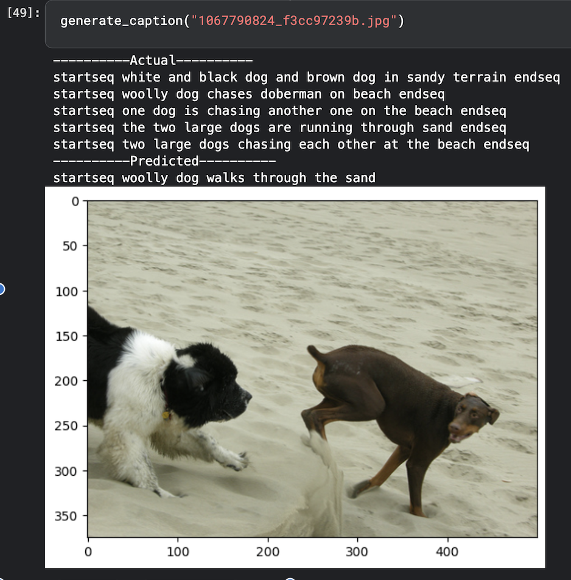
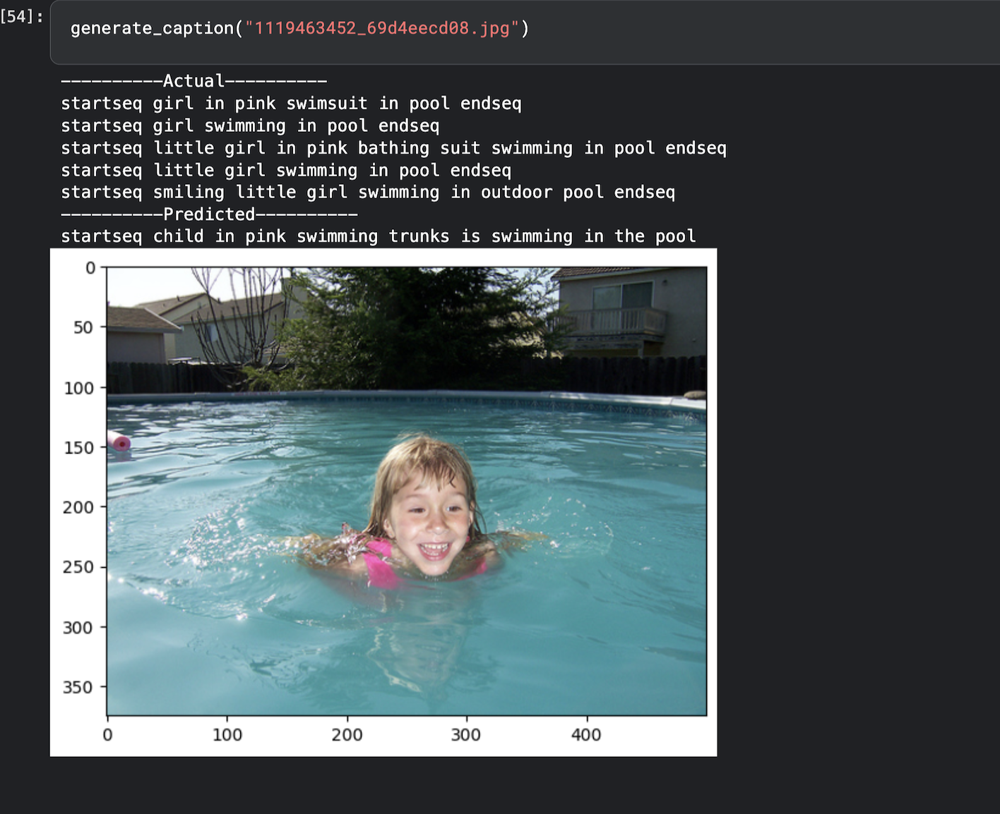
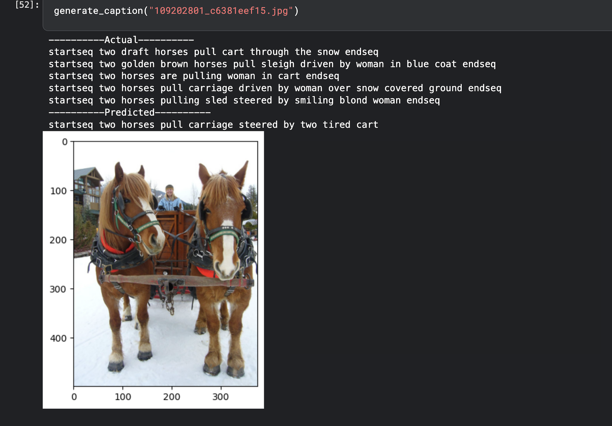
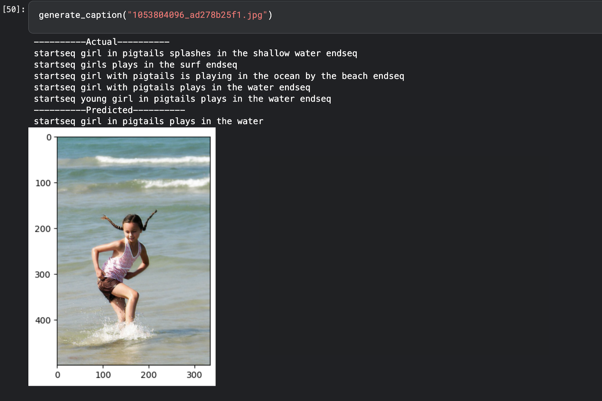

# DeepCaptioning
Automatically generates captions for images using a deep learning model based on VGG16 and LSTM.

---

## Project Overview

This project demonstrates an **image captioning system** that generates human-like descriptions for images. The model is trained on a dataset of images with corresponding captions and leverages **transfer learning** with VGG16 for feature extraction and an LSTM network for sequence modeling.

**Key Highlights:**
- Encoder-Decoder architecture
- Pre-trained VGG16 for image feature extraction
- LSTM for natural language generation
- Achieved BLEU score: **0.48**
- Implemented training and inference in TensorFlow 2.18

---
## Demo

Here’s how the app looks:
  



---

## Model Architecture

**Encoder (Image Features):**  
- Input: 4096-dimensional VGG16 image features  
- Fully connected layer: Dense(256) with ReLU activation  
- Dropout: 0.4  

**Decoder (Text Sequence):**  
- Embedding layer: 256-dimensional, `mask_zero=True`  
- LSTM layer: 256 units  
- Fully connected layer: Dense(256) with ReLU activation and Dropout  
- Output layer: Dense(`vocab_size`) with softmax activation  

**Training Parameters:**  
- Epochs: 20  
- Batch Size: 32  
- Loss Function: Categorical Crossentropy  
- Optimizer: Adam

## Skills & Techniques Used

- Programming: Python, TensorFlow, Keras  
- Deep Learning: CNN + LSTM  
- Image Processing & Feature Extraction  
- Natural Language Processing: Tokenization, Sequence Modeling  
- Model Evaluation: BLEU score  
- Deployment: Flask

## Installation (For Local Setup)

```bash
# Clone repo
git clone https://github.com/Nishant840/DeepCaptioning.git
cd DeepCaptioning

# Create virtual environment
python -m venv venv

# Activate (Linux/macOS)
source venv/bin/activate

# Activate (Windows)
venv\Scripts\activate

# Install dependencies
pip install -r requirements.txt

# Run app
python app.py
```
## Acknowledgements

- **Dataset**: [Flickr8k Dataset](https://www.kaggle.com/datasets/adityajn105/flickr8k) – for training and evaluating the image captioning model.  
- **Libraries / Tools**: TensorFlow, Keras, NumPy, Pandas, Flask, Jinja2, HTML/CSS.
- **Special Thanks**: Open-source contributors and the Kaggle community for datasets, tutorials, and inspiration.
- 
## Author

Nishant Kumar  
IIIT Bhopal • SDE/ML Enthusiast  
https://github.com/Nishant840

